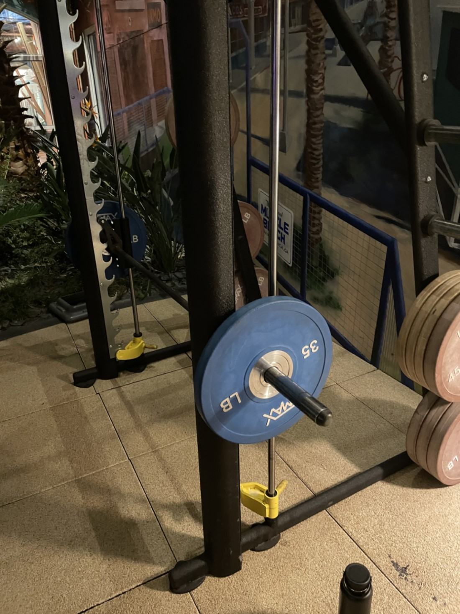

# **Journal Entry One - The Smith Machine at In Motion Fitness**

## By Adrian Arredondo - 02/25/22
---
The smith machine is an important part of any workout, and In Motion Fitness has a handful of this particular model scattered around their gym and the design is quite simple. The barbell is attached to a bar that only moves up and down, which makes it easier for you to lift as you do not need to stabilize it like you would with a free-weight barbell. If you look at the photo, you can see that the barbell is hanging off hooks. To take it off the hooks, you simply need to lift it slightly, then twist your wrist to unhook it, then you can move the bar further up or down. This makes smith machines quite **error-tolerant**, because if you ever need to bail from a set or rep because of muscle failure. All you need to do is twist the bar to hook it back onto the machine. There is also a yellow blocker attached to the machine which will catch the barbell if you are unable to twist it back onto the hook and you have to let go. To move the blocker, all you need to do is swivel it off the hook then you can move it up or down. Both of these features make the design very **safe**, even if you are working without a spotter and have little experience working out at the gym.

I have mainly used this machine to do upright rows, military presses, and occasionally squats when all of the power racks have been taken up. For the most part, you are doing the same sort of movement no matter what exercise you are accomplishing, which is moving the bar up and down parallel to the station. The only real difference is how you are moving the barbell up and down. When you are using the machine, it makes a particular sound that is hard to describe, but it adds to the overall **satisfaction** that you get from doing an exercise with this machine.

