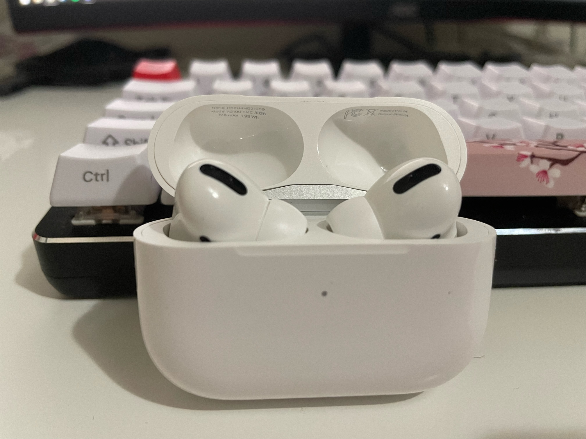

# **Journal Entry Two - AirPods Pro by Apple**

## By Adrian Arredondo - 04/15/22
---
The AirPods Pro, personally my favorite wireless earbuds and a device that I have used everyday since I bought them around a month ago. Like most products that Apple makes,the physical design of the case and earbuds are quite good. An all white plastic case with a metal hinge that feels satisfying to snap open and close, and a pair of earbuds that look like the original Airpods, except with a bent stem and silicone tips, that also snap into place in the case. The earbuds themselves also feel high quality and for the most part, fit well into my ears and don’t irritate them either. 
The main reason why I bought them was because my AirPods 2nd Gen were starting to show wear and tear and because I wanted something with noise cancelation. Ambient noises such as wind, fans, and traffic bother me so I wanted something to block out those sounds, and the AirPods Pro work amazingly in this regard. Which brings me to a problem that has annoyed me since I bought them, which is the **visibility of system status**, or how much feedback a product gives back to the user, of the three different noise control options. On the right AirPod, if you hold down on the stem it will toggle between the three noise control options, and while there is haptic feedback for letting you know that the mode has changed, there is now way to tell which setting you changed to. And in low noise areas, it can be difficult to tell which setting you're on, which leads me to having to tap my foot to differentiate between the noise control.
Another issue that I have with the AirPods Pro that I feel is persistent across all Apple products is the **flexibility and efficiency of use**, or shortcuts and personalization options. For example, with the noise control options, there is no quick way to change them without holding down on the stem. If you want to change the noise control on your iPhone, you have to go into the bluetooth menu in the settings app, click on the ‘i’ icon and only then can you change what mode you’re on. While this isn’t an issue for me any more as I can differentiate between the modes, when I first got them and was having trouble, it was very cumbersome having to go to three different menus in order to change a simple option. 
